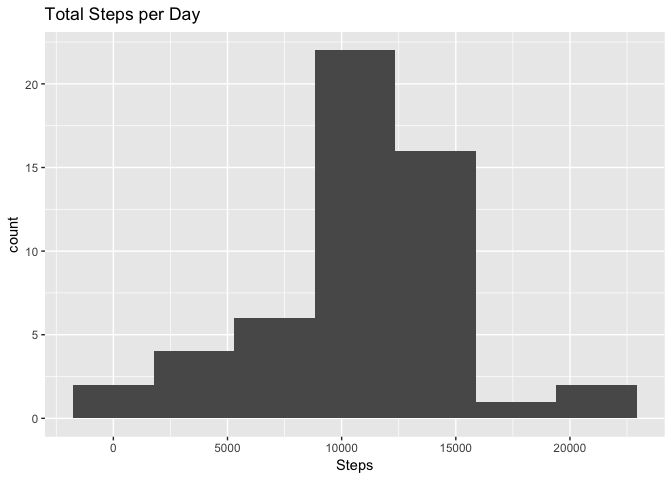
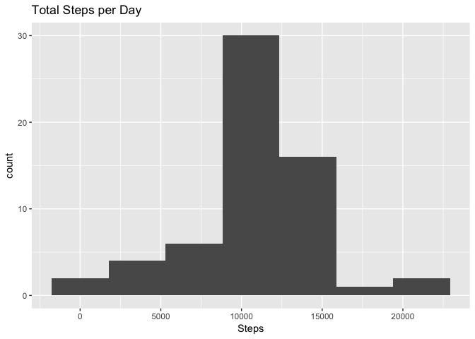
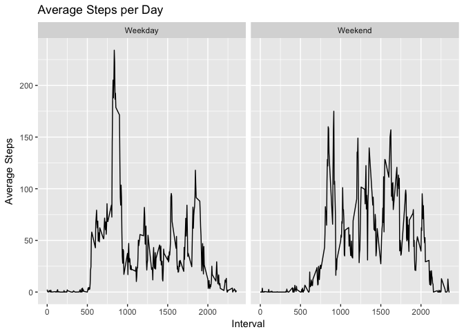

# Reproducible Research: Peer Assessment 1


## Loading and preprocessing the data

```r
activity <- read.csv("activity.csv")
# convert dates
activity$date <- as.Date(activity$date, "%Y-%m-%d")
```


## What is mean total number of steps taken per day?

```r
# group data by date and sum the steps for each date
dailySteps <- with(activity, aggregate(steps, list(date), sum))
colnames(dailySteps) <- c("date", "steps")
# histogram with 7 breaks
library(ggplot2)
ggplot(dailySteps, aes(steps)) +
    geom_histogram() +
    stat_bin(bins = 7) +
    ggtitle("Total Steps per Day") +
    xlab("Steps")
```

<!-- -->

```r
# mean of daily steps with NAs removed
mean(dailySteps$steps, na.rm = TRUE)
```

```
## [1] 10766.19
```

```r
# median of daily steps with NAs removed
median(dailySteps$steps, na.rm = TRUE)
```

```
## [1] 10765
```


## What is the average daily activity pattern?

```r
# group data by interval and average the steps for each interval
periodicSteps <- with(activity, aggregate(steps, list(interval), mean, na.rm = TRUE))
colnames(periodicSteps) <- c("interval", "steps")

ggplot(periodicSteps, aes(interval, steps)) + 
    geom_line() +
    ggtitle("Average Steps per Interval") +
    xlab("Interval") +
    ylab("Average Steps")
```

<!-- -->

```r
# row with max steps
maxRow <- which.max(periodicSteps$steps)
# interval with max steps
periodicSteps[maxRow, "interval"]
```

```
## [1] 835
```

```r
# max steps
periodicSteps[maxRow, "steps"]
```

```
## [1] 206.1698
```


## Imputing missing values

```r
# rows with NA values
naRows <- which(is.na(activity$steps))
length(naRows)
```

```
## [1] 2304
```

```r
# copy data 
activity1 <- activity
# loop through rows with NAs
# determine which intervals have NA
# replace steps with average steps for that interval
for (row in naRows) {
    naInterval <- activity1[row, "interval"]
    avgSteps <- periodicSteps[which(periodicSteps$interval==naInterval), "steps"]
    activity1[row, "steps"] <- avgSteps
}
# rows with NA values
naRows <- which(is.na(activity1$steps))
length(naRows)
```

```
## [1] 0
```

```r
# group data by date and sum the steps for each date
dailySteps1 <- with(activity1, aggregate(steps, list(date), sum))
colnames(dailySteps1) <- c("date", "steps")
# histogram with 7 breaks
ggplot(dailySteps1, aes(steps)) +
    geom_histogram() +
    stat_bin(bins = 7) +
    ggtitle("Total Steps per Day") +
    xlab("Steps")
```

<!-- -->

```r
# mean of daily steps
mean(dailySteps1$steps)
```

```
## [1] 10766.19
```

```r
# median of daily steps
median(dailySteps1$steps)
```

```
## [1] 10766.19
```


## Are there differences in activity patterns between weekdays and weekends?

```r
# apply anonymous function that determines which day it is to each date
# place results into a new column
activity$day <- sapply(activity$date, function(date) {
    day = weekdays(date)
    if (day == "Saturday" || day == "Sunday") day <- "Weekend"
    else day <- "Weekday"
    day
})
# group data by interval and average the steps for each interval
periodicSteps1 <- with(activity, aggregate(steps, list(interval, day), mean, na.rm = TRUE))
colnames(periodicSteps1) <- c("interval", "day", "steps")

ggplot(periodicSteps1, aes(interval, steps)) + 
    facet_grid(.~day) +
    geom_line() +
    ggtitle("Average Steps per Day") +
    xlab("Interval") +
    ylab("Average Steps")
```

<!-- -->
